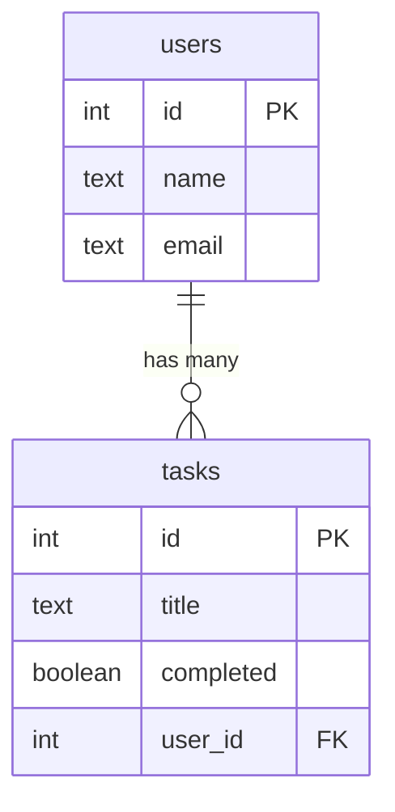

# Project Plan

## Discovery
- The repository contains a Python-based backend (`backend/`) and a TypeScript frontend (`frontend/`).
- No existing Node.js API or database layer is present, so a new persistence stack is required.

## Persistence Stack
- **Server:** Express
- **ORM:** Drizzle
- **Database driver:** better-sqlite3
- **Database file:** `./data/app.db`

## Schema Diagram

## Endpoint List
- `GET /api/users` – list users
- `POST /api/users` – create user
- `GET /api/users/:id` – fetch single user
- `PUT /api/users/:id` – update user
- `DELETE /api/users/:id` – remove user
- `GET /api/users/:id/tasks` – list tasks for a user
- `POST /api/users/:id/tasks` – create task for a user
- `PUT /api/tasks/:id` – update task
- `DELETE /api/tasks/:id` – delete task

## Development Checklist
- [ ] Scaffold Express project structure
- [ ] Configure Drizzle ORM with better-sqlite3
- [ ] Define schema and migrations for `users` and `tasks`
- [ ] Implement CRUD API endpoints
- [ ] Add validation and error handling
- [ ] Document API usage
- [ ] Write tests and configure CI
